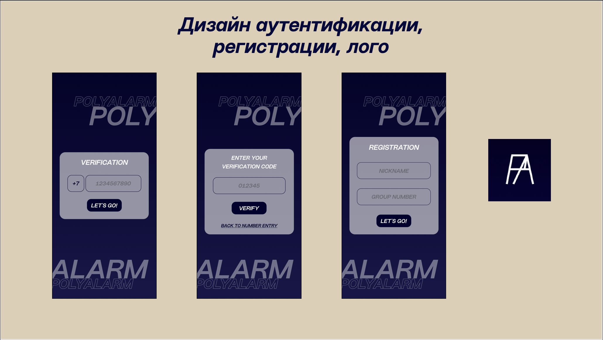
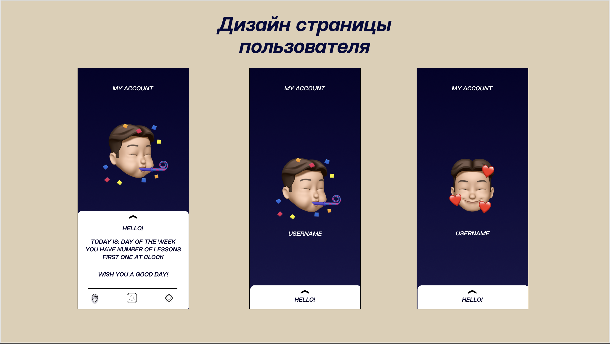
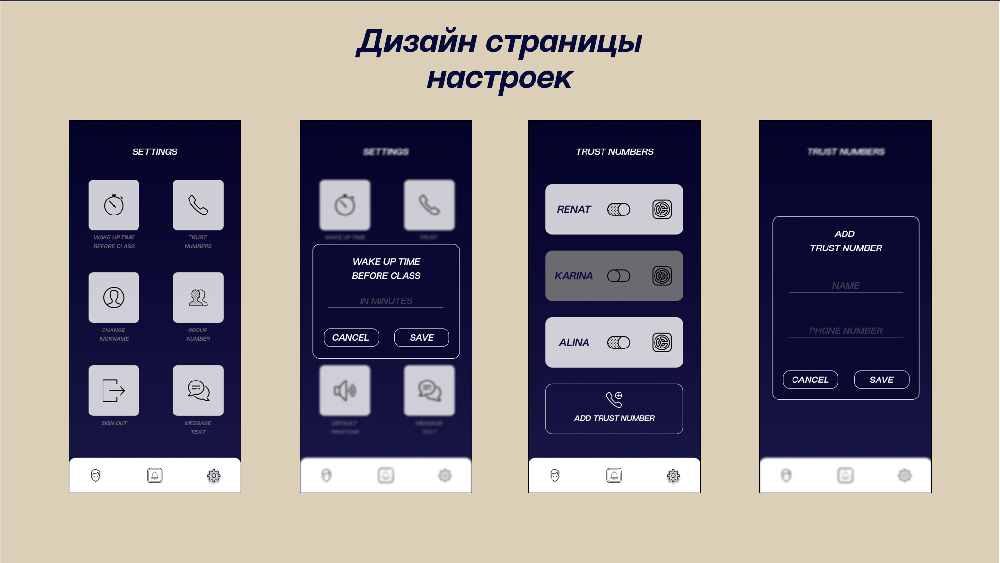
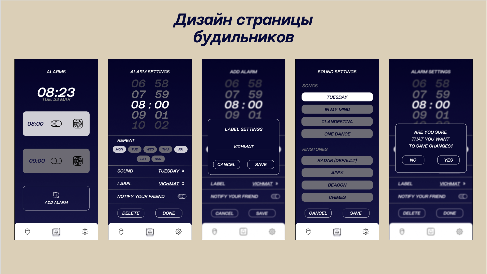

<h1>PolyAlarm</h1>

iOS-приложение, созданное в качестве курсовой работы по предмету "Программная инженерия".

<h2>Фреймворки</h2>
<ul>
  <li>SwiftUI</li>
  <li>Combine</li>
  <li>Foundation</li>
  <li>AVFoundation</li>
  <li>SwiftSoup</li>
  <li>UserNotifications</li>
</ul>
<h2>Технологический стек</h2>

<h2>Дизайн</h2>

<h3>Задачи выполненные мною в процессе разработки проекта</h3>

В проекте я занимала должность тимлида, разрабатывала дизайн интерфейсов, работала с логикой и базой данных. Подробнее вы можете ознакомиться с моей деятельностью в отчете, который лежит в папке Docs.
<ul>
  <li>Определение требований к результату</li>
  <li>Разделение ролей в команде</li>
  <li>Изучение необходимых теоретических материалов</li>
  <li>Определение образа продукта</li>
  <li>Создание дизайна приложения</li>
  <li>Создание иконки приложения</li>
  <li>Создание архитектуры приложения</li>
  <li>Создание схемы базы данных</li>
  <li>Создание базы под верификацию</li>
  <li>Создание базы данных под регистрацию</li>
  <li>Логика аутентификации</li>
  <li>Логика регистрации</li>
  <li>Проверка полей на странице регистрации</li>
  <li>Логика отправки сообщений доверительным номерам</li>
  <li>Разработка алгоритма парсинга</li>
  <li>Связывание расписания с будильниками</li>
  <li>Связывание расписания со страницей пользователя</li>
  <li>Функциональное тестирование</li>
  <li>Создание презентации для защиты проекта</li>
  <li>Создание отчета по проекту</li>
  <li>Защита проекта</li>
</ul>
